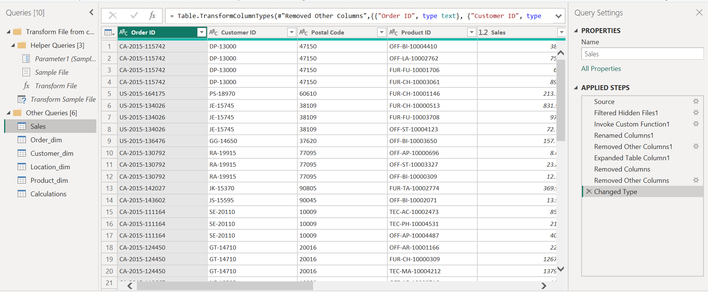
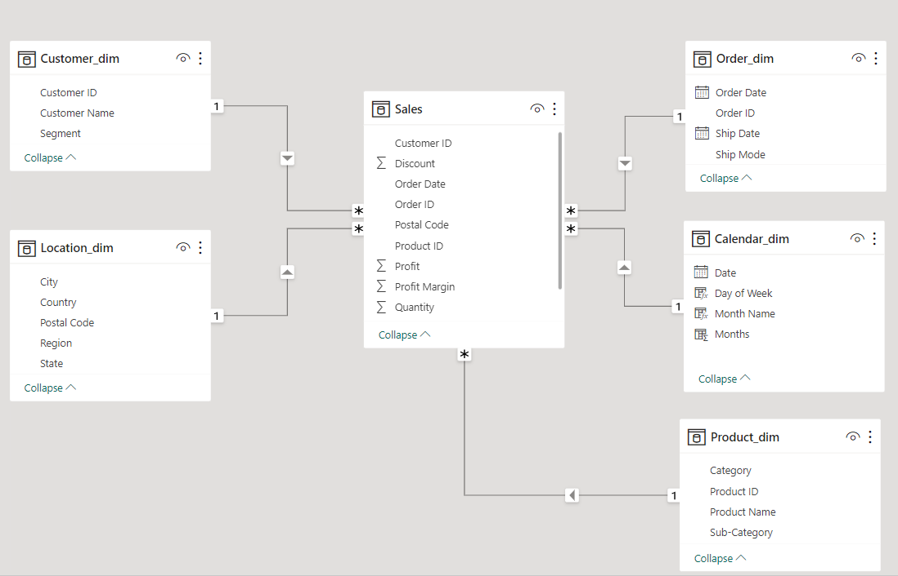
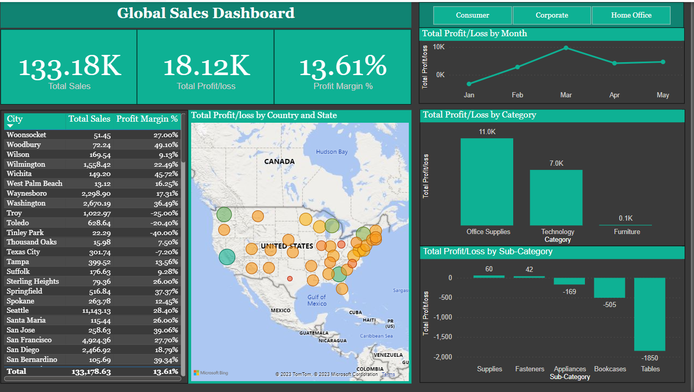

## Global Sales Analysis

---

## Introduction
This is a Power BI project carried out to deliver an end-to-end business intelligence solution for a **Global Store**. The project was done to create a dynamic and interactive dashboard to enable the organization track KPIs on sales, profit/loss, and profit margin, compare regional performance, analyze product-level trends and forecasts, and identify high-value customers.

## Problem Statement
1.	To know the KPIs on sales, total profit / loss and profit margin
2.	Display the profit / loss trend from January to December
3.	Compare the sales across different regions

## Operations performed
The following operations were performed on Power BI:
- Data collection
- Data cleaning
- Data transformation
- Data modelling 
- DAX
- Data visualization

## Data Transformation

The data in Power BI was cleaned and transformed, involving steps such as removing unwanted columns and ensuring all columns were properly formatted to ensure data accuracy.

The table was also broken down into facts and dimension tables during the transformation

---
## Modelling
- The power BI feature was adjusted from automatically detecting relationships to manually performing the operation in other to remove and replace unwanted relationship with only required ones
- The model is a star schema
- There are 4 dimensions table and 1 fact table. The dimension tables are all joined to the fact table with a one-many relationship

---

## Visualization

The report comprise of a 1 page dashboard and visualizations such as card to display KPIs, bar charts, table, Map with bubbles to display the sales across different regions and line chart were used.

## Analysis
- Over a 5-month periodfrom January to May, the highest sales were achieved in march
- Total sales for thses 5 months amounted to $133.8k, with a total profit of $18.12k, resulting in a profit margin of 13.61%
- Among product categories,'Office Supplies" had the highest sales reaching $11k
- In the sub-category there was a notable loss of -$1,850
- The state with the highest sales is Seatle wih a profit of 11.14k and lowest is West palm beach at $13

## Recommmendations
- Given that March had the higest sales, further analysis should be done to know what factors contributed to the success and implement strategies to replicate or improve upon it in other months
- Address the significant loss in the "Tables" sub-category. Explore cost saving measures or evaluate the product's pricing and marketing strategy to mitigate losses
- Given the significant disparity in sales figure between the highest and lowest, a detailed market analysis should be conducted in Seatle area , to understand the factors contributing to high sales and the information can be used to improve the regions with the lowest sales.

